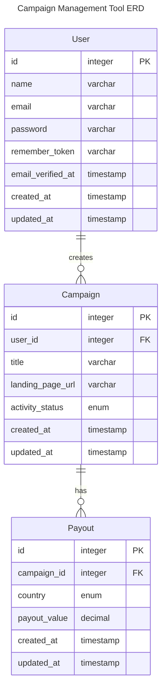

# Campaign Tool Backend

## Project Setup

### Prerequisites

- Docker
- Docker Compose
- Git

## Tech Stack

- Laravel 11.x
- MySQL

## Entity Relationship Diagram



### Setup Instructions

1. Clone the repository then navigate to the project directory
```bash
cd campaign-tool-backend
```

2. Create environment file
```bash
cp .env.example .env
```

3. Start the application
```bash
docker compose up -d
```

4. Install dependencies using Docker
```bash
docker compose exec laravel.test composer install
```

5. Generate application key
```bash
docker compose exec laravel.test php artisan key:generate
```

6. Run database migrations
```bash
docker compose exec laravel.test php artisan migrate
```

7. Restart docker containers
```bash
docker compose restart
```

Now if you open the browser and navigate to http://localhost/api, you should see `{"message":"Hello World"}`

Project was setup using [Laravel Sail](https://laravel.com/docs/9.x/sail)
After initial intall you can start using sail commands as well

```bash
./vendor/bin/sail up
./vendor/bin/sail down
./vendor/bin/sail logs -f
./vendor/bin/sail artisan <command>
./vendor/bin/sail composer <command>
./vendor/bin/sail artisan test
./vendor/bin/sail down --volumes --rmi all
```

### Available Services

- **Application**: http://localhost/api
- **MySQL**: Port 3306
- **Redis**: Port 6379

### Useful Commands

```bash
# Start application
docker compose up -d

# Stop application
docker compose down

# View logs
docker compose logs -f

# Run artisan commands
docker compose exec laravel.test php artisan <command>

# Run composer commands
docker compose exec laravel.test composer <command>

# Run tests
docker compose exec laravel.test php artisan test

# Clean all containers and volumes (useful for fresh start)
docker compose down --volumes --rmi all
```

### Development

The application code is mounted into the container, so any changes you make to your local files will be reflected immediately in the container.