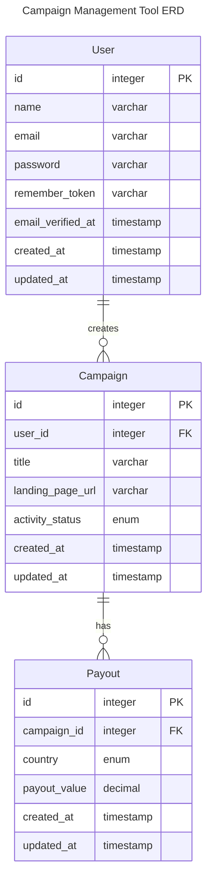

# Campaign Tool Backend

## Project Setup

### Prerequisites

- Docker
- Docker Compose
- Git

## Tech Stack

- Laravel 11.x
- MySQL

## Entity Relationship Diagram



### Setup Instructions

1. Clone the repository then navigate to the project directory
```bash
cd campaign-tool-backend
```

2. Create environment file
```bash
cp .env.example .env
```

3. Start the application
```bash
docker compose up -d
```

4. Install dependencies using Docker
```bash
docker compose exec laravel.test composer install
```

5. Generate application key
```bash
docker compose exec laravel.test php artisan key:generate
```

6. Run database migrations
```bash
docker compose exec laravel.test php artisan migrate
```

7. Restart docker containers
```bash
docker compose restart
```

Now if you open the browser and navigate to http://localhost/api, you should see `{"message":"Hello World"}`

### Available Services

- **Application**: http://localhost/api
- **MySQL**: Port 3306
- **Redis**: Port 6379

### Useful Commands

```bash
# Start application
docker compose up -d

# Stop application
docker compose down

# View logs
docker compose logs -f

# Run artisan commands
docker compose exec laravel.test php artisan <command>

# Run composer commands
docker compose exec laravel.test composer <command>

# Run tests
docker compose exec laravel.test php artisan test

# Clean all containers and volumes (useful for fresh start)
docker compose down --volumes --rmi all
```

### Development

The application code is mounted into the container, so any changes you make to your local files will be reflected immediately in the container.

## Laravel Sponsors

We would like to extend our thanks to the following sponsors for funding Laravel development. If you are interested in becoming a sponsor, please visit the [Laravel Partners program](https://partners.laravel.com).

### Premium Partners

- **[Vehikl](https://vehikl.com/)**
- **[Tighten Co.](https://tighten.co)**
- **[WebReinvent](https://webreinvent.com/)**
- **[Kirschbaum Development Group](https://kirschbaumdevelopment.com)**
- **[64 Robots](https://64robots.com)**
- **[Curotec](https://www.curotec.com/services/technologies/laravel/)**
- **[Cyber-Duck](https://cyber-duck.co.uk)**
- **[DevSquad](https://devsquad.com/hire-laravel-developers)**
- **[Jump24](https://jump24.co.uk)**
- **[Redberry](https://redberry.international/laravel/)**
- **[Active Logic](https://activelogic.com)**
- **[byte5](https://byte5.de)**
- **[OP.GG](https://op.gg)**

## Contributing

Thank you for considering contributing to the Laravel framework! The contribution guide can be found in the [Laravel documentation](https://laravel.com/docs/contributions).

## Code of Conduct

In order to ensure that the Laravel community is welcoming to all, please review and abide by the [Code of Conduct](https://laravel.com/docs/contributions#code-of-conduct).

## Security Vulnerabilities

If you discover a security vulnerability within Laravel, please send an e-mail to Taylor Otwell via [taylor@laravel.com](mailto:taylor@laravel.com). All security vulnerabilities will be promptly addressed.

## License

The Laravel framework is open-sourced software licensed under the [MIT license](https://opensource.org/licenses/MIT).
